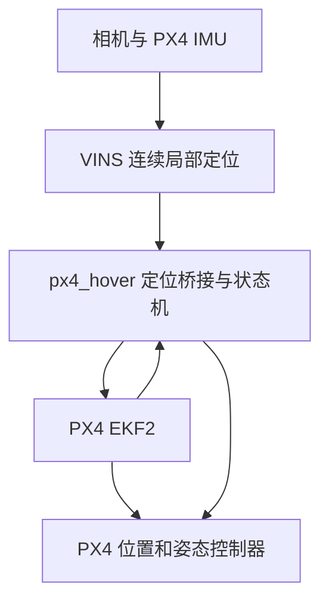

# Robomaster2027 自主飞行无人机控制

自主飞行无人机上层飞行控制算法工作空间（ROS 2 Humble / Ubuntu 22.04）。
数据链路为：工业相机 + PX4 IMU → VINS-Mono 局部定位 → PX4 EKF2 外部视觉融合
→ PX4 原有多旋翼控制器闭环，实现有限高度内的原地悬停。

> **文档说明**：本文档是仓库唯一的说明文档。原先分散在各包内的 README
> （`px4_hover`、`driver_interface`、`mindvision_camera`）以及 `docs/PX4_HOVER.md`、
> `docs/CPP_MIGRATION.md` 的内容已全部合并到这里，那些文件已删除。
> 第三方代码 `src/px4_msgs` 与子模块 `src/VINS-Mono` 保留各自的上游文档。

## 目录

- [1. 分支与包结构](#1-分支与包结构)
- [2. 数据链路与坐标系](#2-数据链路与坐标系)
- [3. 环境依赖与编译](#3-环境依赖与编译)
- [4. PX4 固件 DDS 话题准备](#4-px4-固件-dds-话题准备)
- [5. 飞控参数](#5-飞控参数)
- [6. 时间戳与传感器配置](#6-时间戳与传感器配置)
- [7. 实机启动与显式控制](#7-实机启动与显式控制)
- [8. mindvision_camera：相机驱动](#8-mindvision_camera相机驱动)
- [9. driver_interface：传感器接口](#9-driver_interface传感器接口)
- [10. px4_hover：悬停管理器](#10-px4_hover悬停管理器)
- [11. 分阶段验收和日志](#11-分阶段验收和日志)
- [12. 已验证与尚未验证](#12-已验证与尚未验证)
- [13. C++ 迁移说明](#13-c-迁移说明)
- [14. 参考](#14-参考)

## 1. 分支与包结构

`main` 分支面向 Ubuntu 22.04 + ROS 2 Humble，做**实机 VINS + PX4 悬停**。
移植分支 `ubuntu20.04` 单独维护，补丁不要交叉应用。

工作空间默认是分包安装（colcon 默认），构建产物在 `build/`、`install/`、`log/`。

| 路径 | 职责 |
| --- | --- |
| `src/mindvision_camera` | 迈德威视工业相机驱动；输出格式/帧率/QoS 可配，直接输出 `mono8` |
| `src/driver_interface` | 图像灰度桥接（可关闭）+ PX4 `SensorCombined` → `sensor_msgs/Imu` |
| `src/px4_hover` | VINS → PX4 外部定位桥接、就绪检查、显式起飞/接管/降落状态机 |
| `src/bringup` | 总启动包：`hover_system`、`vins_system`、`vins_system_sim`、`px4_xrce_agent` |
| `src/px4_msgs` | PX4 v1.14 消息定义（以源码 vendored，非子模块） |
| `src/VINS-Mono` | git 子模块，VINS-Mono 的 ROS 2 移植版，锁在 `ec59526` |
| `Camera/` | 相机录制数据（`.mvdat`，被 `.gitignore` 忽略） |

`px4_hover` 已改为 **C++17 / rclcpp / Eigen3**，运行时不依赖 Python/numpy；
launch 和参数接口保持不变。升级方法见 [13. C++ 迁移说明](#13-c-迁移说明)。

## 2. 数据链路与坐标系



桥接读取 `/vins_estimator/imu_propagate`，同时检查 `/vins_estimator/odometry`
视觉优化是否持续更新。**不使用 pose_graph 优化后的路径做控制反馈**。起步阶段
先关闭回环 launch，并在自己的 VINS 文件设置 `loop_closure: 0`，保持标定不变。
未来全局地图可维护 map→odom，局部控制反馈必须连续，不能直接注入回环跳变。

VINS 的 world 只有重力方向有约束，初始 yaw 和原点是任意的。管理器在第一次
有效 VINS 样本上寻找时间差不超过 0.1 秒的 PX4 姿态，做一次 yaw/原点对齐。
有有效 PX4 局部位置时使用该位置作为原点锚，否则从局部零点启动。变换之后固定。
不要在飞行中 reset 管理器、重启 VINS 或更换该变换。

本仓库 VINS 输出的 pose 是 IMU 原点，而不是相机光心；线速度是 world 系。
输出给 PX4 的 position/velocity 是已对齐的 NED，姿态是 body FRD→NED，
四元数排列 wxyz。`imu_from_body_xyzw` 默认 identity，因为 `driver_interface` 已
将板级 PX4 FRD IMU 转成 FLU。更换 IMU 来源/轴定义时需重新核对，不要填相机外参。

## 3. 环境依赖与编译

### 3.1 环境

代码在 Ubuntu 22.04 + ROS 2 Humble 下开发和测试。

**1. Ubuntu 22.04**

**2. ROS 2 Humble**（参照小鱼的一键安装）

```bash
# 克隆
git clone https://github.com/Spaaaace-yyj/RM_Dron_control.git
git -c 'url.https://github.com/.insteadOf=git@github.com:' submodule update --init --recursive
# 确保安装了 ROS 2 Humble
sudo apt update

sudo apt install -y \
  git build-essential cmake pkg-config \
  python3-colcon-common-extensions python3-rosdep \
  python3-numpy python3-yaml python3-opencv \
  libopencv-dev libeigen3-dev libceres-dev \
  libboost-filesystem-dev \
  libboost-program-options-dev \
  libboost-system-dev

sudo apt install -y \
  ros-humble-ament-cmake \
  ros-humble-ament-cmake-auto \
  ros-humble-ament-index-cpp \
  ros-humble-ament-index-python \
  ros-humble-rclcpp \
  ros-humble-rclcpp-components \
  ros-humble-builtin-interfaces \
  ros-humble-std-msgs \
  ros-humble-sensor-msgs \
  ros-humble-geometry-msgs \
  ros-humble-nav-msgs \
  ros-humble-visualization-msgs \
  ros-humble-cv-bridge \
  ros-humble-image-transport \
  ros-humble-image-transport-plugins \
  ros-humble-camera-info-manager \
  ros-humble-camera-calibration \
  ros-humble-tf2 \
  ros-humble-tf2-ros \
  ros-humble-rosidl-default-generators \
  ros-humble-rosidl-default-runtime \
  ros-humble-ros-environment \
  ros-humble-launch \
  ros-humble-launch-ros \
  ros-humble-ros2launch \
  ros-humble-rviz2 \
  ros-humble-rqt-image-view \
  ros-humble-ament-lint-auto \
  ros-humble-ament-lint-common

sudo rosdep init
rosdep update

rosdep install \
  --from-paths src \
  --ignore-src \
  --rosdistro humble \
  -y
```

另外需要 `libeigen3-dev`、`ros-humble-ament-cmake-test`（`px4_hover` 核心测试）：

```bash
sudo apt install libeigen3-dev ros-humble-ament-cmake-test
```

### 3.2 编译

```bash
# 退出 Conda；ROS launch/构建工具仍使用系统 Python
conda deactivate
source /opt/ros/humble/setup.bash
git submodule update --init --recursive
rosdep install --from-paths src --ignore-src -r -y
colcon build --symlink-install \
  --packages-up-to bringup vins_estimator \
  --cmake-args -DCMAKE_BUILD_TYPE=Release \
  -DPython3_EXECUTABLE=/usr/bin/python3 -DPYTHON_EXECUTABLE=/usr/bin/python3
source install/setup.bash
```

只编译相机、接口和启动包：

```bash
colcon build --symlink-install \
  --packages-up-to mindvision_camera driver_interface bringup \
  --cmake-args -DCMAKE_BUILD_TYPE=Release
source install/setup.bash
```

仓库根目录的 `build.sh` 提供等价的一键编译：

```bash
./build.sh
```

已有子模块 SSH 访问限制时，将 `.gitmodules` 的 URL 改为对应 HTTPS 后再执行
`git submodule sync`，或使用你原来已成功的子模块拉取方法。

## 4. PX4 固件 DDS 话题准备

PX4 v1.14.3 默认 `src/modules/uxrce_dds_client/dds_topics.yaml` 已有传感器、状态、
姿态、局部位置和输入视觉里程计/目标/心跳等话题，但**没有默认发布**管理器需要的
`estimator_status_flags` 与建议使用的 `vehicle_command_ack`。

在你的 PX4 固件源码的 **publications 列表中追加**：

```yaml
  - topic: /fmu/out/estimator_status_flags
    type: px4_msgs::msg::EstimatorStatusFlags
  - topic: /fmu/out/vehicle_command_ack
    type: px4_msgs::msg::VehicleCommandAck
```

可参考 `src/px4_hover/config/px4_dds_additions.yaml`，**不是用该文件覆盖整个 DDS
文件，也不是 ROS 参数文件**。保留原有发布/订阅条目，使用自己板型对应的构建目标
重新编译并刷入固件。这里不提供未知板型的刷写命令。确认串口、921600 波特率与
飞控 uxrce_dds_client 的链路设置一致，且只运行一个 agent。

`px4_msgs` 必须与飞控消息定义匹配。若使用厂商修改版 PX4，核对该固件 DDS 定义和
消息字段，不要简单改成 px4_msgs main。当前工程携带 release/1.14 消息。

启动后检查：

```bash
ros2 topic info -v /fmu/out/vehicle_status
ros2 topic echo /fmu/out/estimator_status_flags --once --qos-reliability best_effort
ros2 topic echo /fmu/out/timesync_status --once --qos-reliability best_effort
```

未补 DDS 发布会一直 WAIT_READY，status 会写明缺失话题；这不是 VINS 没有运行。
不要为了飞起来关闭实机融合状态检查。

## 5. 飞控参数

通过 QGroundControl 保存原始参数，再设置针对室内 VINS 的参数。节点不自动写飞控
参数，不绕过预飞检查，也不改你已经调好的机架/电机/姿态 PID。

| 参数 | 本方案起步设置/检查 |
| --- | --- |
| `EKF2_EV_CTRL` | 11，外部水平位置+高度+yaw；速度确认可信后可评估 15 |
| `EKF2_HGT_REF` | 3，外部视觉高度参考；重启后生效 |
| `EKF2_EV_NOISE_MD` | 0，消息方差并受飞控噪声参数下限约束 |
| `EKF2_EV_QMIN` | 0；桥接没有校准质量分数，quality=-1 表示未知 |
| `EKF2_EV_DELAY` | 先核对采样时间，再根据 ULog 评估剩余延迟，单位 ms |
| `EKF2_EV_POS_X/Y/Z` | 外部 pose 原点，即 VINS IMU，相对重心的 FRD 坐标，单位 m |
| `COM_OF_LOSS_T` | 例如 0.5 s，需在完整 PX4 上验证失联行为 |
| `COM_OBL_RC_ACT` | 室内可选择 4（Land），同时验证定位失效、RC 接管等场景 |

其他传感器融合按实机设置确认。室内测试若要验证完全依赖 VINS 的定位，就不要让
已有 GNSS/其他外部源掩盖 VINS 故障；但不要机械地关掉气压计/磁力计/预飞检查。
保持 RC 接管通道和你已验证的飞控失效保护。姿态控制器需先能稳定手动飞行。

`EKF2_EV_POS` 是 **消息所报告位置原点** 的杆臂，不要填 Kalibr 的相机到 IMU
平移。用飞控 IMU 做 VINS 时，测量该 IMU 在机体重心的前/右/下方向偏移。
若以后在桥接中补偿到机体重心，这里也要相应改零，避免重复补偿。

管理器发布的方差是 `position_stddev` 等参数的平方，和 `acc_n/gyr_n` 不是同一种
噪声。初期不默认融合 VINS 速度，是为了先验证速度约定、延迟，并避免将同源 IMU
传播速度当成独立高可信观测；打开速度融合要结合 innovation 与飞行记录评估。

## 6. 时间戳与传感器配置

PX4 v1.14.3 uXRCE-DDS 在序列化/反序列化中根据 session offset 转换
`timestamp` / `timestamp_sample`。健康的 DDS 输出应已经落在 ROS 时钟域。
本管理器发布 ROS 时钟时间，**不再次减 timesync estimated_offset**。

实机 `use_sim_time: false`。相机采样时间、`/px4/imu`、VINS headers 和 DDS 状态
应与主机时钟一致。本次总 launch 默认用 `bringup/config/camera_interface.yaml`：
30 FPS、相机直接 mono8 发布 `/image_raw`、driver_interface 只转换 IMU，
`timestamp_mode: px4`、FRD→FLU。

你的 VINS 标定 YAML 至少核对这些项：

```yaml
image_topic: "/image_raw"
imu_topic: "/px4/imu"
estimate_extrinsic: 0
estimate_td: 0
loop_closure: 0
save_image: 0
```

相机内外参、分辨率、翻转方式与原来的标定必须一致。`td` 保留你已验证的值。
`td` 是 VINS 相机–IMU 偏移，不是 `EKF2_EV_DELAY`，两者不能照抄或重复扣除。
相机若仍按完成处理/接收时刻打时间戳，应先评估传输和曝光延迟；本修改不会将它
自动变成真实曝光采样时间。`first_arrival/ros_now` 时间模式不用于最终悬停验证。

> 注意：仓库内 `src/VINS-Mono/config/euroc/euroc_config_px4.yaml` 目前是
> `loop_closure: 1`、`save_image: 1`、`td: 0`，属于原通用配置，**不满足**上面
> 悬停验收要求。实机请复制一份自己维护的 YAML，按上表改成
> `loop_closure: 0`、`save_image: 0` 并填入你已验证的 `td`，用
> `vins_config_file:=` 显式传入，不要直接改这个通用文件。

## 7. 实机启动与显式控制

复制 `src/px4_hover/config/px4_hover.yaml` 到你维护的配置目录。所有管理器参数都
在其中，launch 只传入该路径。另保留单独的传感器 YAML 和 VINS OpenCV YAML。

```bash
source /opt/ros/humble/setup.bash
source install/setup.bash
ros2 launch bringup hover_system.launch.py \
  vins_config_file:=/绝对路径/你的实机标定.yaml \
  hover_config_file:=/绝对路径/px4_hover.yaml \
  agent_device:=/dev/ttyUSB0 agent_baud:=921600
```

| launch 参数 | 默认 | 说明 |
| --- | --- | --- |
| `vins_config_file` | 无（必填） | 实机标定的 OpenCV YAML 绝对路径 |
| `hover_config_file` | `px4_hover/config/px4_hover.yaml` | 管理器参数文件 |
| `sensor_config_file` | `bringup/config/camera_interface.yaml` | 相机 + 接口共用的多节点 YAML |
| `use_rviz` | `false` | 是否启动 RViz2 |
| `start_agent` | `true` | 是否启动 `MicroXRCEAgent` |
| `agent_device` / `agent_baud` | `/dev/ttyUSB0` / `921600` | 串口 agent 设备与波特率 |

串口 agent 已经启动时加 `start_agent:=false`。此实机 launch 强制
`use_sim_time=false`，不启动回环；不要同时启动旧的 `vins_system.launch.py`。

另一终端观察：

```bash
source install/setup.bash
ros2 topic echo /px4_hover/status
ros2 topic hz /vins_estimator/odometry
ros2 topic hz /vins_estimator/imu_propagate
ros2 topic hz /fmu/in/vehicle_visual_odometry
ros2 topic info -v /fmu/in/offboard_control_mode
```

初次将相机/IMU 刚性整体做适度运动初始化 VINS，放回稳定位置后等待 READY。
地面保持不动并不保证单目 VINS 完成初始化。节点检测多个心跳发布者时会拒绝接管，
所以不要同时运行旧 Offboard 测试脚本或另一个控制节点。

默认 `allow_arm_requests: false`：READY 后由 RC 解锁，再显式调用：

```bash
ros2 service call /px4_hover/takeoff std_srvs/srv/Trigger '{}'
```

会先发送 1.5 秒位置目标和心跳，再请求 Offboard，实际状态确认后开始限速爬升。
默认相对上升 1 m，水平位置和 yaw 捕获后固定。需要软件解锁时先明确配置
`allow_arm_requests: true`，节点才会在服务请求后请求解锁，依然服从 PX4 检查。

已经由 RC 起飞、速度低于 `max_start_speed` 时，用 hold 接管当前悬停点：

```bash
ros2 service call /px4_hover/hold std_srvs/srv/Trigger '{}'
```

降落：

```bash
ros2 service call /px4_hover/land std_srvs/srv/Trigger '{}'
```

这是 AUTO.LAND 请求，不是上位机自行闭环降落。遥控切出 Offboard 后管理器不再
自动抢回，后续操作由 RC/PX4 完成。复飞前地面上锁，必要时恢复/重启 VINS，再：

```bash
ros2 service call /px4_hover/reset std_srvs/srv/Trigger '{}'
```

管理器不能直接重启相机/IMU/VINS 的其他进程；它负责监测、拒绝无效定位与协调
控制状态。继续 READY 后也必须再次显式操作。

### 7.1 单独启动总 launch（不带悬停管理器）

相机**节点代码的默认值**是全速 `rgb8`、图像话题 `/image_raw`；
`driver_interface` 节点代码默认 `enable_image_bridge: true`，会转换图像并发布
`/image_gray`。改成 `mono8` 后，相机话题仍然是同一个 `image_topic`，不会按编码
自动改名。注意仓库自带的 `camera_params.yaml` 已改成
`mono8 / 30 FPS / /image_gray`，`bringup/config/driver_interface.yaml` 已改成
`enable_image_bridge: false`，实机请以第 7 节的提醒为准。

全速 RGB（原行为）：

```bash
ros2 launch mindvision_camera mv_launch.py \
  full_speed:=true output_encoding:=rgb8
```

30 FPS 灰度、低延迟 QoS（话题仍为 `/image_raw`）：

```bash
ros2 launch mindvision_camera mv_launch.py \
  full_speed:=false target_fps:=30 output_encoding:=mono8 \
  use_sensor_data_qos:=true qos_depth:=1
```

只启动 IMU 接口：

```bash
ros2 launch driver_interface driver_interface.launch.py enable_image_bridge:=false
```

此时自己的 VINS 标定配置应写成：

```yaml
image_topic: "/image_raw"
imu_topic: "/px4/imu"
```

`src/bringup/config/camera_interface.yaml` 是可选的“30 FPS 灰度 + IMU-only”配置，
不改变默认启动行为。其中相机参数放在 `/camera_node`，接口参数放在
`/driver_interface`。

```bash
SENSOR_CONFIG="$(ros2 pkg prefix --share bringup)/config/camera_interface.yaml"
ros2 launch bringup vins_system.launch.py \
  camera_config_file:="$SENSOR_CONFIG" \
  driver_config_file:="$SENSOR_CONFIG" \
  vins_config_file:=/绝对路径/你的VINS标定配置.yaml \
  use_pose_graph:=false use_rviz:=false
```

也可以使用总 launch 参数覆盖各自默认配置：

```bash
ros2 launch bringup vins_system.launch.py \
  camera_full_speed:=false camera_target_fps:=30 \
  camera_output_encoding:=mono8 camera_use_sensor_data_qos:=true \
  enable_image_bridge:=false \
  vins_config_file:=/绝对路径/你的VINS标定配置.yaml
```

总 launch 还支持 `camera_image_topic`、`camera_qos_depth`、`start_agent`、
`agent_device`、`agent_baud`。

> **默认配置不自洽提醒**：`mindvision_camera/config/camera_params.yaml` 默认
> `image_topic: /image_gray` + `mono8`，而 `bringup/config/driver_interface.yaml`
> 默认 `enable_image_bridge: false`，通用 VINS 配置又订阅 `/image_raw`。
> 直接跑不带参数的 `vins_system.launch.py` 会造成“相机发 `/image_gray`、
> VINS 收 `/image_raw`、灰度桥接关闭”的断链。请显式传
> `camera_config_file`/`driver_config_file`（推荐用
> `bringup/config/camera_interface.yaml`），或开启 `enable_image_bridge:=true`。
>
> `vins_system_sim.launch.py` 只启动 VINS（`use_sim_time: true`），
> 相机/IMU 由配套 MuJoCo 仿真仓库提供，不要和实机 launch 同时运行。

### 7.2 帧率、时间戳与 QoS 验证

```bash
ros2 topic hz /image_raw
ros2 topic echo /image_raw --once --field encoding --qos-reliability best_effort
ros2 topic echo /image_raw --once --field step --qos-reliability best_effort
ros2 topic info -v /image_raw
ros2 node info /driver_interface
ros2 topic hz /px4/imu
```

- `rgb8` 时 `step = width * 3`，`mono8` 时 `step = width`；宽高和话题不变。
- 30 FPS 设置是长期平均目标/上限，不会把低于 30 FPS 的输入补成 30 FPS。
  100 FPS 经软件限流时，相邻输出可能为 30/40 毫秒；日志分别显示
  `capture`（取到 SDK 帧）与 `publish`（发布到 ROS）的频率。
- SDK 只保证部分相机支持 `CameraSetFrameRate`。不支持时会打印警告并在 ISP
  处理前跳过多余帧，不用采集线程 `sleep()`。这降低处理和 ROS 传输负载，
  **不一定降低相机到主机的 USB/网口带宽**；SDK 灰度输出也不等于传感器原始流改变。
- 关闭图像桥接后，`ros2 node info /driver_interface` 不应出现图像订阅/发布，
  IMU 链路不受影响。
- Best Effort 发布器不能连接要求 Reliable 的订阅器。检查实际运行的
  feature_tracker 图像订阅端 QoS；RViz 图像显示也要设置为 Best Effort。
- 保留已有硬件时间戳映射（相机 tick 单位 0.1 毫秒），不会用发布时间重打时间戳。
  这仍是首帧到达时间锚定，不等于相机与 IMU 硬件同步；`timestamp_mode`、标定
  `td` 与 IMU 坐标变换仍需使用已验证设置。更改曝光、翻转、分辨率后重新验证标定。

## 8. mindvision_camera：相机驱动

ROS 2 迈德威视相机包，提供 MindVision 相机的 ROS API。
上游原始环境为 Ubuntu 20.04 + ROS 2 Galactic；本仓库 `main` 分支面向
Ubuntu 22.04 + ROS 2 Humble。新增格式/帧率功能需要在本机相机上验证，
不代表已验证所有相机型号。

### 8.1 相机输出控制

`output_encoding:=rgb8` 或 `mono8` 控制 SDK 输出格式，不管哪种编码，图像话题
都使用同一个 `image_topic`（默认 `/image_gray`，可用 launch 参数改成 `/image_raw`），
不会按格式自动改话题。

```bash
# 全速 RGB，保留原有行为
ros2 launch mindvision_camera mv_launch.py full_speed:=true output_encoding:=rgb8

# 30 FPS 灰度；也可把 mono8 改成 rgb8 发布 30 FPS 彩色
ros2 launch mindvision_camera mv_launch.py \
  full_speed:=false target_fps:=30 output_encoding:=mono8 \
  use_sensor_data_qos:=true qos_depth:=1

# 使用自定义配置文件（仍可同时用上述参数显式覆盖）
ros2 launch mindvision_camera mv_launch.py config_file:=/绝对路径/camera_params.yaml
```

节点内默认值（`config/camera_params.yaml` 会覆盖）：`full_speed: true`、
`target_fps: 30`、`output_encoding: rgb8`、`use_sensor_data_qos: false`、
`qos_depth: 1`。`target_fps` 为正整数，全速模式下忽略；这些参数需要重启节点生效。

| 参数 | 默认 | 作用 |
| --- | --- | --- |
| `full_speed` | `true` | 全速采集/发布；`false` 启用限帧 |
| `target_fps` | `30` | 限帧目标，整数 Hz；全速时忽略 |
| `output_encoding` | `rgb8` | `rgb8` 彩色或 `mono8` 灰度，SDK 直接输出 |
| `use_isp` | `false` | `false` 节点内 Bayer→灰度去马赛克（满帧率）；`true` 走 SDK ISP（Jetson 约 27 fps） |
| `image_topic` | `/image_raw`（节点默认） | 两种编码共用的图像话题；`camera_params.yaml` 中为 `/image_gray` |
| `use_sensor_data_qos` | `false` | `true` 使用 Best Effort；VINS 建议开启 |
| `qos_depth` | `1` | 传输队列深度 |

新参数文件使用 `/**`；launch 同时兼容旧 `/mv_camera` 和 `/camera_node` 配置。
`frame_id` 参数也会实际应用于图像及 CameraInfo 的消息头。

`mono8` 且 `use_isp: false` 时，节点直接用 `bayerGB8_to_gray()` 在
`CameraImageProcess()` 之前去马赛克：BAYGB8 布局中绿色像素位于 `(x + y)` 为偶数的
位置，R/B 像素复用其左右两个绿色邻居的均值。这绕开了 SDK ISP 流水线的吞吐瓶颈。

限帧先尝试硬件设置；不支持则按硬件图像时间戳在 `CameraImageProcess()` 前
跳过多余帧。软件限帧只降低 ISP/ROS 负载，不保证降低 USB 带宽。
SDK 灰度不需要在另一个节点执行 RGB 到灰度转换。每秒日志分别打印取帧与发布频率。

灰度输出配合 `driver_interface enable_image_bridge:=false` 时，VINS 直接订阅
`/image_raw`（需把 `image_topic` 设为 `/image_raw`，例如用
`src/bringup/config/camera_interface.yaml`）。

### 8.2 编译与启动

```bash
mkdir -p ros_ws/src
cd ros_ws/src
git clone https://github.com/chenjunnn/ros2_mindvision_camera.git
cd ..
rosdep install --from-paths src --ignore-src -r -y
colcon build --symlink-install --packages-up-to mindvision_camera
```

```bash
ros2 launch mindvision_camera mv_launch.py
```

主要 launch 参数：

1. `config_file`：相机参数文件的路径；
2. `camera_info_url`：相机内参文件的路径；
3. `use_sensor_data_qos`：相机 Publisher 是否使用 SensorDataQoS（默认 `false`）。

`src/mindvision_camera/mvsdk/` 已带 x86_64 与 arm64 的 `libMVSDK.so`，CMake 会按
`CMAKE_SYSTEM_PROCESSOR` 自动选择。

### 8.3 标定

标定教程可参考 <https://navigation.ros.org/tutorials/docs/camera_calibration.html>，
参数意义请参考 <http://wiki.ros.org/camera_calibration>。
标定后的相机参数会被存放在 `/tmp/calibrationdata.tar.gz`。

```bash
ros2 run camera_calibration cameracalibrator --size 8x11 --square 0.02000 image:=/image_raw
```

### 8.4 通过 rqt 动态调节相机参数

打开 rqt，在 Plugins 中添加 `Configuration -> Dynamic Reconfigure` 及
`Visualization -> Image View`。可在线调节 `exposure_time`、`analog_gain`、
`rgb_gain.r/g/b`、`saturation`、`gamma`、`flip_image`；其余格式/帧率/QoS 参数为
启动只读，改后需重启节点。

### 8.5 无硬件逻辑测试

README 早期版本引用的
`src/mindvision_camera/test/frame_rate_limiter_test.cpp` 与
`tests/test_sensor_launch_parameters.py` **不在当前工作空间中**
（`/tests/` 被 `.gitignore` 忽略），需要自行提供测试文件后才能执行：

```bash
g++ -std=c++14 -Wall -Wextra -Werror \
  src/mindvision_camera/test/frame_rate_limiter_test.cpp \
  -o /tmp/rm_camera_frame_rate_test
/tmp/rm_camera_frame_rate_test
python3 -m unittest discover -s tests -p 'test_sensor_launch_parameters.py' -v
```

测试覆盖全速/限帧、100/200 Hz 降到 30 Hz、低帧率输入、重复时间戳/时间跳变，
以及 YAML/启动参数优先级与类型转换。Python 测试使用轻量替身检查配置逻辑，
不替代真实 ROS launch、SDK 相机和 DDS 集成测试。

## 9. driver_interface：传感器接口

面向 ROS 2 Humble、PX4 1.14 和 VINS-Mono ROS 2 的传感器接口节点。
节点完成两条数据转换：

```text
工业相机 Image                          mono8 Image
/image_raw           -> driver_interface -> /image_gray

PX4 SensorCombined                       sensor_msgs/Imu
/fmu/out/sensor_combined -> driver_interface -> /px4/imu
```

### 9.1 功能

- 将 `rgb8`、`bgr8`、`rgba8`、`bgra8` 等图像转换为 `mono8`；
- 保留相机消息原始 `header.stamp`，默认保留原始 `frame_id`；
- 将 PX4 `gyro_rad` 和 `accelerometer_m_s2` 转为 `sensor_msgs/msg/Imu`；
- 默认进行 PX4 FRD 到 ROS FLU 的坐标变换：`(x, y, z) -> (x, -y, -z)`；
- 使用 PX4 1.14 `SensorCombined.timestamp`，而不是每帧都使用回调到达时间；
- 相机、PX4 输入以及转换后的输出均采用 Sensor Data QoS；
- 检测并默认丢弃非单调 IMU 时间戳。

`SensorCombined` 不包含姿态，因此输出消息设置 `orientation_covariance[0] = -1`。

### 9.2 只接收 IMU，不接收图像

启动参数 `enable_image_bridge` 默认为 `true`（保留原行为）。设为 `false` 时既不
创建图像订阅器，也不创建灰度发布器，IMU 转换保持不变：

```bash
ros2 launch driver_interface driver_interface.launch.py enable_image_bridge:=false
```

也可以在 YAML 中设置 `enable_image_bridge: false`；总 launch 使用的是
`bringup/config/driver_interface.yaml` 或显式传入的 `driver_config_file`。
只有显式传入的启动参数才会覆盖 YAML。改变开关后重启节点。

相机直接输出 `mono8` 时，话题仍然是 `image_topic`（`camera_interface.yaml` 里为
`/image_raw`），此时 VINS 配置使用 `image_topic: "/image_raw"`、
`imu_topic: "/px4/imu"`，不需要灰度中转节点。桥接开启时则使用 `/image_gray`
（以实际 `gray_output_topic` 为准），输入和输出不能指向同一话题，也不要让两个
节点同时发布同一灰度输出话题。

### 9.3 编译、DDS 环境与启动

```bash
cd ~/Code/HBUT2025_rm_vision/Dron/px4_ros2_ws
source /opt/ros/humble/setup.bash
rosdep install --from-paths src --ignore-src -r -y
colcon build --symlink-install \
  --packages-up-to driver_interface \
  --cmake-args -DCMAKE_BUILD_TYPE=Release
source install/setup.bash
```

按当前 PX4 链路设置 DDS 环境：

```bash
export ROS_DOMAIN_ID=0
export ROS_LOCALHOST_ONLY=0
export RMW_IMPLEMENTATION=rmw_fastrtps_cpp
```

默认话题启动：

```bash
ros2 launch driver_interface driver_interface.launch.py
```

如果工业相机实际话题为 `/mv_25001498/image_raw`：

```bash
ros2 launch driver_interface driver_interface.launch.py \
  camera_input_topic:=/mv_25001498/image_raw
```

也可以直接运行节点并加载参数文件：

```bash
ros2 run driver_interface driver_interface_node --ros-args \
  --params-file "$(ros2 pkg prefix --share driver_interface)/config/driver_interface.yaml"
```

### 9.4 配置 VINS-Mono

在自己的 VINS 配置中修改：

```yaml
image_topic: "/image_gray"   # 关闭图像桥接且相机直出灰度时用 "/image_raw"
imu_topic: "/px4/imu"
```

第一次测试自己的相机和 IMU 外参时可以使用 `estimate_extrinsic: 2`，
稳定后应使用离线标定结果并改为 `estimate_extrinsic: 0`。
外参必须对应本节点输出的 `imu_link_flu` 坐标系，而不是 PX4 原始 FRD 坐标系。

### 9.5 时间戳模式

参数 `timestamp_mode` 有四种值：

**`auto`（默认，推荐）**：节点比较第一条 `SensorCombined.timestamp` 和当前 ROS
时间。如果两者相差不超过 `auto_direct_threshold_sec`（默认 10 秒），说明
PX4/uXRCE-DDS 已经将时间映射到 ROS 时基，直接使用 PX4 时间；如果相差很大，
说明收到的可能是飞控启动时间，自动退化为下面的 `first_arrival` 固定偏移方式。

**`first_arrival`（快速联调）**：第一条 IMU 到达时只计算一次
`clock_offset = ros_now - px4_timestamp`，后续使用
`t_ros = t_px4 + clock_offset + timestamp_offset_sec`。这样保留 PX4 IMU 的采样
间隔，不会把每次 DDS/串口传输抖动写入时间戳。但第一次消息的传输延迟会成为固定
误差，因此它适合快速跑通，不替代硬件同步。

**`px4`（正式同步链路）**：`t_ros = t_px4 + timestamp_offset_sec`。只有在 PX4
时间已经被映射到与相机相同的时基，或者你已经准确计算出 `timestamp_offset_sec`
时使用。实机悬停使用此模式。

**`ros_now`（只用于连通测试）**：使用回调到达时间。DDS、USB 和串口抖动会进入
时间戳，不适合最终 VIO。

启动时覆盖参数：

```bash
ros2 launch driver_interface driver_interface.launch.py \
  timestamp_mode:=px4 \
  timestamp_offset_sec:=0.0
```

VINS 的 `estimate_td: 1` 只能补偿近似固定的相机—IMU 时间偏移，不能消除随机
传输抖动。

### 9.6 检查输出

确认输入存在：

```bash
ros2 topic info -v /image_raw
ros2 topic info -v /fmu/out/sensor_combined
```

检查灰度图像：

```bash
ros2 topic hz /image_gray
ros2 topic echo /image_gray --once --field encoding
ros2 run rqt_image_view rqt_image_view /image_gray
```

编码应为 `mono8`。检查 IMU：

```bash
ros2 topic hz /px4/imu
ros2 topic echo /px4/imu --once
```

水平静止且采用 FLU 时，预期：

- 角速度接近 `(0, 0, 0)` rad/s；
- 加速度模长约为 `9.8 m/s^2`；
- 水平且 IMU `z` 轴朝上时，`z` 应接近 `+9.8 m/s^2`（取决于安装方向）。

检查图像与 IMU 时间戳是否处于同一时基：

```bash
ros2 topic echo /image_gray --once --field header.stamp
ros2 topic echo /px4/imu --once --field header.stamp
```

两者不应相差飞控启动时间或 Unix 纪元量级。

### 9.7 参数表

| 参数 | 默认值 | 说明 |
| --- | --- | --- |
| `enable_image_bridge` | `true`（节点默认） | `false` 不创建任何图像订阅/发布，仅转换 IMU；仓库 YAML 已设为 `false` |
| `camera_input_topic` | `/camera/image_raw`（节点默认） | 工业相机图像输入；仓库 YAML 中为 `/image_raw` |
| `gray_output_topic` | `/camera/image_gray`（节点默认） | VINS 灰度图像输出；仓库 YAML 中为 `/image_gray` |
| `px4_imu_input_topic` | `/fmu/out/sensor_combined` | PX4 SensorCombined |
| `imu_output_topic` | `/px4/imu` | VINS IMU |
| `image_frame_id` | 空 | 空时保留原相机 frame_id |
| `imu_frame_id` | `imu_link_flu` | 转换后的 IMU 坐标系 |
| `convert_frd_to_flu` | `true` | Y、Z 轴取反 |
| `timestamp_mode` | `auto` | IMU 时间戳策略 |
| `timestamp_offset_sec` | `0.0` | 手动附加固定偏移，单位秒 |
| `auto_direct_threshold_sec` | `10.0` | 自动模式判断同一时基的阈值 |
| `drop_non_monotonic_imu` | `true` | 丢弃时间戳倒退/重复消息 |
| `angular_velocity_variance` | `0.0` | 角速度协方差对角元素（方差，不是标准差） |
| `linear_acceleration_variance` | `0.0` | 加速度协方差对角元素 |

### 9.8 常见问题

**VINS 一直显示 waiting for image and imu**：依次检查
`ros2 topic hz <灰度话题>`、`ros2 topic hz /px4/imu`、
`ros2 topic info -v <灰度话题>`、`ros2 topic info -v /px4/imu`，
同时确认 VINS YAML 的话题名完全一致。

**图像存在但 VINS 频繁重置**：检查相机 `header.stamp` 是否单调。节点保留相机
驱动给出的曝光时间戳，不会用回调时间覆盖它。

**IMU 频率正常但无法初始化**：重点检查图像和 IMU 是否同一时基；PX4 FRD→FLU 是否
与实际安装和外参标定一致；陀螺仪单位是否为 rad/s；加速度单位是否为 m/s² 且包含
重力；相机—IMU 外参和相机内参是否正确。

## 10. px4_hover：悬停管理器

面向本仓库 `main`、Ubuntu 22.04 / ROS 2 Humble、PX4 v1.14.3 和匹配的
`px4_msgs release/1.14`。这是显式操作的悬停管理器：启动只传外部定位，
不会解锁、切 Offboard 或起飞。位置、速度、姿态、角速度闭环由飞控完成。

运行节点使用 `rclcpp`，矩阵和四元数使用 Eigen3；状态机、VINS 校验和消息桥接
均为 C++，不依赖 Python/numpy。launch 仍采用 ROS 2 的 Python 启动文件。
源码分为 `include/px4_hover/core.hpp`、`src/core.cpp` 和
`src/px4_hover_node.cpp`。所有参数为启动配置，运行中设为只读；改 YAML 后重启节点。

### 10.1 输入与输出

| 接口 | 用途 |
| --- | --- |
| `/vins_estimator/imu_propagate` | 高频 IMU 时刻的 VINS 状态，位置原点是 VINS IMU |
| `/vins_estimator/odometry` | 检查视觉优化持续更新，避免只有 IMU 传播仍被判定正常 |
| `/feature_tracker/restart` | 重启事件触发锁定，地面显式 reset 后才能恢复 |
| `/fmu/out/vehicle_status` | 实际模式、解锁、failsafe；作为命令完成依据 |
| `/fmu/out/vehicle_local_position` | 飞控用于控制的局部位置/速度/航向与有效性 |
| `/fmu/out/vehicle_attitude` | 初始化时按时间戳匹配航向，固定世界坐标变换 |
| `/fmu/out/timesync_status` | 实机 DDS 同步状态；仿真关闭该要求 |
| `/fmu/out/estimator_status_flags` | 确认 EKF2 外部位置、高度、航向融合；实机必须补 DDS 发布 |
| `/fmu/out/vehicle_command_ack` | 拒绝原因；PX4 默认 DDS 未发布，建议一并添加 |
| `/fmu/in/vehicle_visual_odometry` | 对齐后的 NED 状态、FRD 姿态，使用观测采样时间 |
| `/fmu/in/offboard_control_mode` | 50 Hz 位置模式心跳，只在显式控制阶段发送 |
| `/fmu/in/trajectory_setpoint` | 固定 XY 和 yaw，Z 按限速爬升到相对起飞高度 |
| `/fmu/in/vehicle_command` | 有限重试的模式切换、可选解锁、降落请求 |
| `/px4_hover/status` | JSON 状态和具体未就绪/故障原因，5 Hz |

本仓库 VINS 写入的线速度是 **world 系速度**，虽然普通 odometry 的
`child_frame_id=body`。因此默认 `vins_velocity_frame: world`，不要按 child frame
再旋转一次。使用另一套 VIO 时必须核对源代码。

第一次成功匹配 VINS 和 PX4 姿态后固定 yaw/原点变换。运行中不会不断重对齐，
不会把累计漂移隐藏掉。ENU → NED，body FLU → FRD；消息四元数由 ROS 的
xyzw 转成 PX4 的 wxyz。输入 IMU 已由 `driver_interface` 从 PX4 FRD 转为 FLU，
所以 `imu_from_body_xyzw` 默认单位旋转。它是轴向安装旋转，不是相机外参。

### 10.2 状态与操作

`WAIT_READY → READY → PRIMING → REQUEST_OFFBOARD → REQUEST_ARM（按需）
→ TAKEOFF → HOVER`。另有 `MANUAL`、`FAULT`、`LANDING`。

```bash
ros2 topic echo /px4_hover/status
ros2 service call /px4_hover/takeoff std_srvs/srv/Trigger '{}'
ros2 service call /px4_hover/hold std_srvs/srv/Trigger '{}'
ros2 service call /px4_hover/land std_srvs/srv/Trigger '{}'
ros2 service call /px4_hover/reset std_srvs/srv/Trigger '{}'
```

- `takeoff`：从当前 PX4 局部位置上升 `takeoff_height`，不是离地绝对高度。
  默认不允许节点发解锁命令；先使用 RC 解锁。将 `allow_arm_requests` 明确设为
  true 后，仍必须调用该服务，且 Offboard 状态确认后才请求解锁。
- `hold`：必须已经解锁并且低速；捕获调用时的位置与 yaw，不额外上升。
- `land`：仅在已经解锁、仍为 Offboard 且 PX4 未进入 failsafe 时接受，交给
  PX4 AUTO.LAND。其他模式通过 RC/PX4 操作，不会被管理器覆盖。
- `reset`：必须收到新鲜的未解锁状态；清空 VINS 对齐和监测锁定并递增外部定位
  reset_counter。不会重启 VINS，也不会自动再次起飞。先在地面恢复 VINS 再 reset。

起飞前持续发送心跳/目标 1.5 秒。命令 ACK 接受不代表已经切模式或解锁，必须
实际 VehicleStatus 确认。暂时拒绝在重试预算内处理；明确拒绝、超时进入 FAULT。
遥控接管或意外上锁后停止指令，不自动抢回模式、不自动重新解锁。

VINS/PX4 消息超时、时间倒退、异常跳变、飞控位置重置、控制误差过大或出现
第二个 Offboard 心跳发布者，会停止心跳。仅在飞控仍处于 Offboard、状态新鲜
且未自行进入 failsafe 时请求 LAND，最多三次。PX4 failsafe 优先，实际定位失效
后的降落能力仍取决于飞控自身传感器和配置。没有空中强制上锁逻辑。

### 10.3 默认门限和配置

`config/px4_hover.yaml` 包含全部管理器参数，可以复制到 `bringup/config` 自行维护。

| 参数 | 默认 | 含义 |
| --- | --- | --- |
| `takeoff_height` / `climb_speed` | 1.0 m / 0.25 m/s | 相对起飞高度 / 爬升目标速度 |
| `max_vio_age` / `max_backend_age` | 0.3 s / 0.8 s | 传播状态 / 视觉优化的新鲜度 |
| `max_px4_age` / `stable_seconds` | 0.5 s / 2.0 s | PX4 新鲜度 / 连续稳定等待 |
| `max_start_speed` | 0.35 m/s | 允许接管时的最大速度 |
| `max_hover_error` | 1.0 m | 相对当前阶段目标的三维误差上限 |
| `max_pose_jump` | 0.4 m | 跳变基值，另加 `max_vio_speed` × 采样间隔 |
| `max_yaw_jump` | 0.6 rad | 航向跳变基值，另加 3 rad/s × 采样间隔 |
| `position_stddev` / `velocity_stddev` / `orientation_stddev` | 0.1 m / 0.15 m/s / 0.1 rad | 配置的观测标准差，发布时平方成方差 |
| `require_timesync` / `require_ev_status` / `require_ev_yaw` | true / true / true | 实机同步及 EKF 融合检查 |
| `imu_from_body_xyzw` | `[0, 0, 0, 1]` | PX4 body FLU → VINS IMU FLU 的安装旋转 |
| `vins_velocity_frame` | `world` | `world` 或 `body` |
| `publish_rate_hz` | 50.0 | 心跳/诊断定时器频率，范围 [10, 200] |
| `prime_seconds` / `command_interval` / `command_timeout` | 1.5 / 1.0 / 8.0 s | 预热时长 / 命令重发间隔 / 状态确认超时 |
| `max_command_attempts` | 5 | 模式切换/解锁命令重试上限 |
| `allow_arm_requests` | false | 是否允许节点在服务请求后请求解锁 |
| `hover_tolerance` | 0.15 m | 判定到达目标高度的容差 |

观测方差是保守配置，**不是 VINS 在线估计的协方差，也不是 IMU Allan 方差**。
这些门限能发现明显异常，无法证明 VINS 不会缓慢漂移，后续需按飞行日志评估。
后端时间门限应大于实际正常优化延迟；不能用放宽超时掩盖 NX 算力/时间同步问题。

### 10.4 单独启动与测试

传感器、VINS 和 agent 已启动时，只运行管理器，避免重复节点：

```bash
ros2 launch px4_hover px4_hover.launch.py config_file:=/绝对路径/px4_hover.yaml
```

不用 ROS 的原生 C++ 核心测试（已安装 `libeigen3-dev`）：

```bash
cmake -S src/px4_hover -B build/hover_core \
  -DPX4_HOVER_CORE_ONLY=ON -DCMAKE_BUILD_TYPE=Release
cmake --build build/hover_core -j4
ctest --test-dir build/hover_core --output-on-failure
./build/hover_core/hover_core_test
```

ROS 工作空间测试：

```bash
colcon test --packages-select px4_hover --event-handlers console_direct+
colcon test-result --verbose
```

核心用例位于 `src/px4_hover/test/test_core.cpp`，覆盖四元数归一化与非法值拒绝、
对齐 yaw/原点与 world/body 速度、安装旋转、VINS 看门狗（预热、后端超时、重复
时间戳、帧不匹配、位置/航向跳变、时钟回退、tracker 重启锁定）、状态机（默认不
解锁、无启动心跳、显式解锁时序、hold 目标冻结、ROS 时钟暂停不爬升、意外上锁不
自动重解锁、命令超时/永久拒绝/临时拒绝重试、跟踪误差、空中不 reset、降落重试
上限、非法配置拒绝）等。

## 11. 分阶段验收和日志

先仿真，再拆桨桌面验证：图像/IMU 新鲜度、手动平移/旋转方向、Z 向上对应 NED
Z 减小、姿态轴和 EKF EV flags。检查飞控实际接受外部定位，不仅看 RViz 路径。
随后在适合测试的场地验证低高度接管、短时悬停、遥控切出、正常降落。
高度、失联、定位故障的完整飞控保护通过真实 PX4/SITL 和 ULog 分别验证。

```bash
ros2 bag record -o hover_test \
  /px4/imu /vins_estimator/odometry /vins_estimator/imu_propagate \
  /feature_tracker/restart /px4_hover/status \
  /fmu/in/vehicle_visual_odometry /fmu/in/offboard_control_mode \
  /fmu/in/trajectory_setpoint /fmu/in/vehicle_command \
  /fmu/out/vehicle_status /fmu/out/vehicle_attitude \
  /fmu/out/vehicle_local_position /fmu/out/estimator_status_flags \
  /fmu/out/vehicle_command_ack /fmu/out/timesync_status
```

同时下载飞控 ULog；确认 rosbag 实际收到了 Best Effort 数据，必要时提供 QoS
override。不要在 NX 首次控制测试时同时录无压缩高分辨率图像，先测 CPU、处理延迟
和后端频率，再单独做图像记录。

记录：静置/悬停位移、速度尖峰、EV innovation/rejection、控制误差、状态转换原因、
frame 时序、失联与接管结果。短时没发散不代表精度或飞行可靠性达标；单目 VINS
缓慢漂移可能通过所有门限，后续仍需要场地测试与标签/地图等全局校正方案。

## 12. 已验证与尚未验证

已知通过的范围：

- 36 项 `px4_hover` 原生 C++ 核心用例、Release/CTest，以及
  AddressSanitizer/UndefinedBehaviorSanitizer 检查通过；受环境限制未运行
  LeakSanitizer，因此不声称做过内存泄漏检查。
- 1000 组随机坐标转换数据与旧 Python 实现对照一致，最大绝对误差约 `6.7e-15`。
- 配套仿真仓库的 MuJoCo 3.3.7 原生控制核 3 项 CTest 通过，包含外部观测偏移、
  定位丢失和空中 reset-counter 变化。

本工作空间的现状：

- `build/px4_hover/colcon_build.rc` 为 `0`，`install/px4_hover/lib/px4_hover/px4_hover_node`
  是指向 ELF 可执行文件的符号链接，说明 **ROS 2 C++ 适配层在本机编译通过**。
- 但 `log/` 下没有 `colcon test` 结果记录，且当前环境没有真实飞控：
  **DDS 通信、完整 VINS+图像渲染闭环、EKF2 融合及实机飞行尚未验证**。
  请按本文档逐项测试，不能把这些纯逻辑/原生仿真测试当成完整飞行链路验收。

## 13. C++ 迁移说明

本版面向 `main`、Ubuntu 22.04 / ROS 2 Humble / PX4 v1.14.3，沿用原来所有话题、
服务、YAML 配置和 launch 接口。VINS 标定文件、PX4 参数及 DDS 补充要求不变。

### 13.1 补丁二选一

- **没有应用上一版控制补丁**：使用 `control-hover-cpp-full.patch`，基线是
  `f78ecec5319b2f8d0fec10d46189deb1370415b8`。
- **已经应用上一版 `control-hover-main.patch`**：只使用
  `control-python-to-cpp.patch`。无论旧补丁已提交还是未提交，都先执行
  `git apply --check`。该补丁会移除旧 Python 节点/核心和测试，加入 C++ 实现；
  不会修改传感器标定或 YAML 参数值。

不要把完整补丁和升级补丁连续应用。两条路径得到相同的最终代码。
如有本地修改导致 `--check` 失败，保留修改，在对应基线的独立工作树先测试。

```bash
# 控制仓库根目录；下面举例是已经应用旧版的升级路径
git status --short
git apply --check /绝对路径/control-python-to-cpp.patch
git apply /绝对路径/control-python-to-cpp.patch
git diff --stat
```

MuJoCo 控制/桥接代码原来就为 C++，消息接口无需再迁移。如果已经应用旧 sim
补丁，可以继续使用（`sim-hover-cpp-upgrade.patch` 只更新说明文档和格式）；
若尚未应用，使用 `sim-hover-cpp-full.patch`，基线
`7536db08450ad63586081d622386fdb3c4bd186f`。

> 上述补丁文件不在本仓库内，属于升级流程的外部输入。

### 13.2 清理旧包产物与编译

默认 colcon 是分包安装。确认停止旧 `px4_hover` 进程后，在控制工作空间根目录：

```bash
conda deactivate
source /opt/ros/humble/setup.bash
sudo apt install libeigen3-dev ros-humble-ament-cmake-test
# 只清理这个包的生成产物，不删除 src 或其他包；适用于默认分包 install
rm -rf build/px4_hover install/px4_hover
colcon build --symlink-install --packages-up-to bringup vins_estimator \
  --cmake-args -DCMAKE_BUILD_TYPE=Release \
  -DPython3_EXECUTABLE=/usr/bin/python3 -DPYTHON_EXECUTABLE=/usr/bin/python3
source install/setup.bash
file "$(ros2 pkg prefix px4_hover)/lib/px4_hover/px4_hover_node"
```

`file` 应指向 ELF 可执行程序，而不是 Python 脚本。如果使用 `--merge-install`，
不要删除整个共享 install，也不要套用上述分包清理；使用新的 build/install 目录：

```bash
# 已 source 现有依赖工作空间后，将新包构建为独立 overlay
colcon --log-base log_hover_cpp build \
  --build-base build_hover_cpp --install-base install_hover_cpp \
  --packages-select px4_hover --allow-overriding px4_hover \
  --cmake-args -DCMAKE_BUILD_TYPE=Release
source install_hover_cpp/setup.bash
file "$(ros2 pkg prefix px4_hover)/lib/px4_hover/px4_hover_node"
```

所有操作终端都 source 新 overlay；模拟器终端也应使用该 C++ 包的路径。
编译失败时提供完整日志，不用关闭检查或同时启动旧节点来绕过。

### 13.3 启动与服务

启动方法与上一版相同，不需要重写 bringup 或仿真 launch：

```bash
# 实机
ros2 launch bringup hover_system.launch.py \
  vins_config_file:=/绝对路径/你的标定.yaml \
  hover_config_file:=/绝对路径/px4_hover.yaml
# 仿真（另一个隔离域/测试过程，不能和真实飞控同域同时运行）
ros2 launch drone_sim vins_hover.launch.py joy:=false
```

二者按测试场景选择其一。状态 `/px4_hover/status`、服务 `/takeoff` `/hold` `/land`
`/reset` 及参数名保持原样。启动不会自动解锁，实机默认不允许节点发解锁命令。
仍须初始化 VINS、确认 READY、显式操作。具体顺序见第 7 节。

### 13.4 C++ 项目结构

| 文件 | 职责 |
| --- | --- |
| `include/px4_hover/core.hpp` | 状态、配置、观测与动作类型，独立核心接口 |
| `src/core.cpp` | Eigen 坐标/四元数转换，VINS 健康检查，悬停状态机 |
| `src/px4_hover_node.cpp` | rclcpp 订阅/发布、服务、定时心跳、PX4 状态及诊断 |
| `test/test_core.cpp` | 36 项独立核心用例，不依赖 ROS 环境 |
| `config/px4_hover.yaml` | 保留原参数名与默认值，参数在启动时读取并设为只读 |
| `config/px4_dds_additions.yaml` | 需合并进 PX4 固件的 DDS 发布条目（文档性参考） |

节点用 `SingleThreadedExecutor` 和默认回调组串行处理状态。心跳/超时用
steady/wall 时钟，运动目标爬升用 ROS 时钟。ROS 发送时间仍由 DDS 转换，
不能再次扣同步偏移。矩阵为固定大小 Eigen 对象；运行节点没有 Python 解释器或
numpy。ROS launch、colcon 工具和仿真纹理生成脚本仍按原方案使用 Python。

### 13.5 验证范围

```bash
colcon test --packages-select px4_hover --event-handlers console_direct+
colcon test-result --verbose

# 无 ROS 时验证 C++ 核心
cmake -S src/px4_hover -B build/hover_core \
  -DPX4_HOVER_CORE_ONLY=ON -DCMAKE_BUILD_TYPE=Release
cmake --build build/hover_core -j4
ctest --test-dir build/hover_core --output-on-failure
./build/hover_core/hover_core_test
```

C++ 迁移不代表解决 VINS 漂移、完成 EKF2 融合验收或降低 VINS 本体的计算量。
沿用第 11 节的实机分阶段验收、日志与遥控接管流程。

## 14. 参考

- [PX4 v1.14 参数](https://docs.px4.io/v1.14/en/advanced_config/parameter_reference)
- [PX4 v1.14 Offboard](https://docs.px4.io/v1.14/en/flight_modes/offboard)
- [PX4 v1.14 uXRCE-DDS](https://docs.px4.io/v1.14/en/middleware/uxrce_dds)
- [PX4 v1.14.3 DDS 话题源文件](https://github.com/PX4/PX4-Autopilot/blob/v1.14.3/src/modules/uxrce_dds_client/dds_topics.yaml)
- [PX4 v1.14.3 DDS 时间戳转换生成脚本](https://github.com/PX4/PX4-Autopilot/blob/v1.14.3/src/modules/uxrce_dds_client/generate_dds_topics.py)
- [ROS 2 相机标定教程](https://navigation.ros.org/tutorials/docs/camera_calibration.html)
- [camera_calibration 参数说明](http://wiki.ros.org/camera_calibration)
- [ros2_mindvision_camera 上游](https://github.com/chenjunnn/ros2_mindvision_camera)
