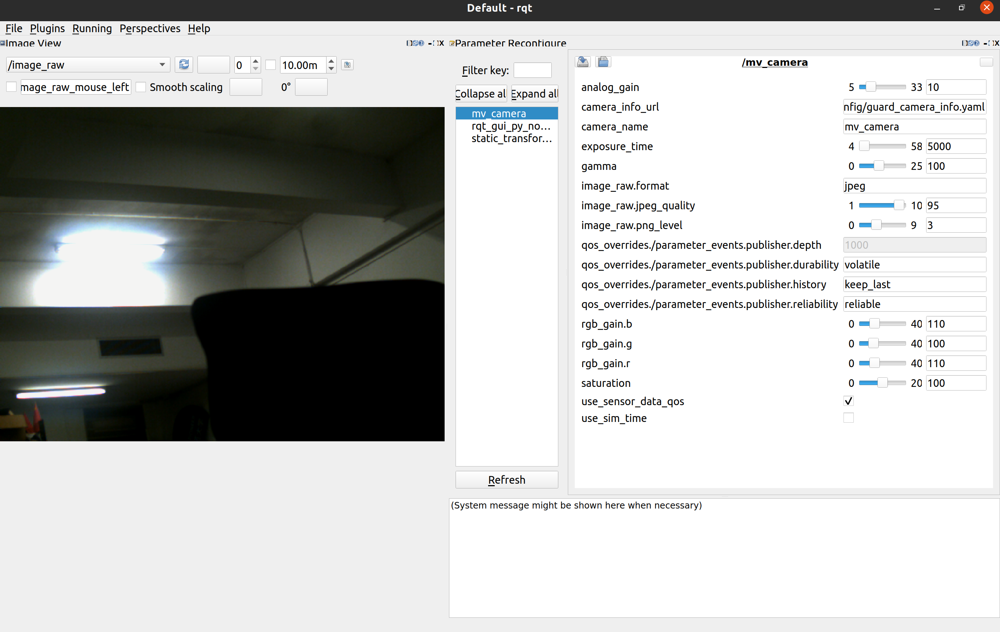

# ros2_mindvision_camera

ROS2 MindVision 相机包，提供了 MindVision 相机的 ROS API。

Only tested under Ubuntu 20.04 with ROS2 Galactic

本仓库 `ubuntu20.04` 分支面向 Ubuntu 20.04 + ROS 2 Foxy；上面是上游原始环境说明。
新增格式/帧率功能需要在本机相机上验证，不代表已验证所有相机型号。

## 相机输出控制（ubuntu20.04 / Foxy）

`output_encoding:=rgb8` 或 `mono8` 控制SDK输出格式，不管哪种编码，图像话题
都使用同一个 `image_topic`（默认 `/image_raw`），不会按格式自动改话题。

```bash
# 全速RGB，保留原有行为
ros2 launch mindvision_camera mv_launch.py full_speed:=true output_encoding:=rgb8

# 30 FPS灰度；也可把 mono8 改成 rgb8 发布30 FPS彩色
ros2 launch mindvision_camera mv_launch.py \
  full_speed:=false target_fps:=30 output_encoding:=mono8 \
  use_sensor_data_qos:=true qos_depth:=1

# 使用自定义配置文件（仍可同时用上述参数显式覆盖）
ros2 launch mindvision_camera mv_launch.py config_file:=/绝对路径/camera_params.yaml
```

默认 `full_speed: true`、`target_fps: 30`、`output_encoding: rgb8`、
`use_sensor_data_qos: false`、`qos_depth: 1`。`target_fps` 为正整数，
全速模式下忽略；这些参数需要重启节点生效。

新参数文件使用 `/**`；launch同时兼容旧 `/mv_camera` 和 `/camera_node` 配置。
`frame_id` 参数也会实际应用于图像及CameraInfo的消息头。

限帧先尝试硬件设置；不支持则按硬件图像时间戳在 `CameraImageProcess()` 前
跳过多余帧。软件限帧只降低ISP/ROS负载，不保证降低USB带宽。
SDK灰度不需要在另一个节点执行RGB到灰度转换。每秒日志分别打印取帧与发布频率。

灰度输出配合 `driver_interface enable_image_bridge:=false` 时，VINS直接订阅
`/image_raw`。QoS与完整系统启动方式见根目录 README。


## 使用说明

### Build from source

#### Dependencies

- [ROS 2 Foxy](https://docs.ros.org/en/foxy/)（本分支运行环境）

#### Building

使用本仓库 `ubuntu20.04` 分支，在仓库根目录执行：

```bash
source /opt/ros/foxy/setup.bash
rosdep install --from-paths src --ignore-src -r --rosdistro foxy -y
colcon build --symlink-install --packages-up-to mindvision_camera \
  --cmake-args -DCMAKE_BUILD_TYPE=Release
source install/setup.bash
```

### 标定

标定教程可参考 https://navigation.ros.org/tutorials/docs/camera_calibration.html

参数意义请参考 http://wiki.ros.org/camera_calibration

标定后的相机参数会被存放在 `/tmp/calibrationdata.tar.gz`

### 启动相机节点

    ros2 launch mindvision_camera mv_launch.py
	ros2 run camera_calibration cameracalibrator --size 8x11 --square 0.02000  image:=/image_raw
支持的参数：

1. config_file： 相机参数文件的路径
2. camera_info_url： 相机内参文件的路径
3. use_sensor_data_qos： 相机 Publisher 是否使用 SensorDataQoS (default: `false`)

### 通过 rqt 动态调节相机参数

打开 rqt，在 Plugins 中添加 `Configuration -> Dynamic Reconfigure` 及 `Visualization -> Image View`


